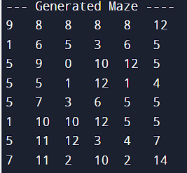
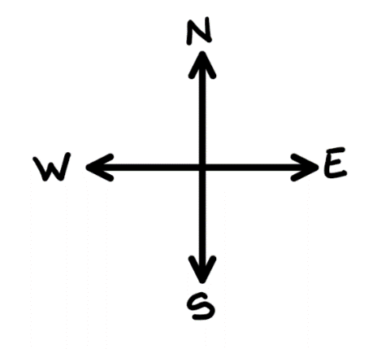
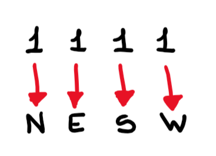
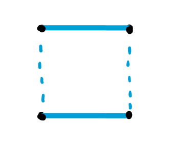
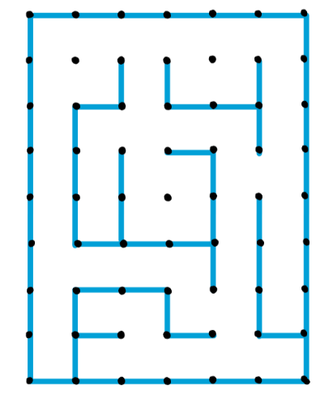
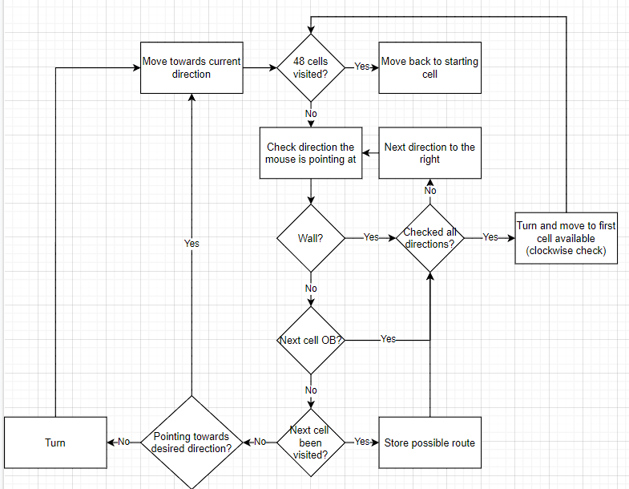
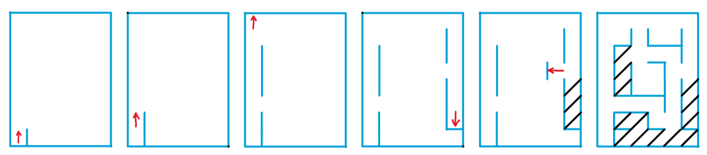
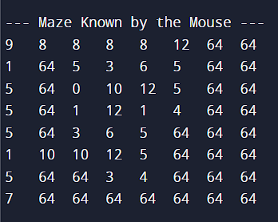
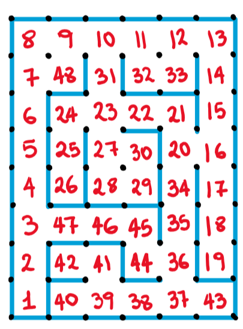

# Micromouse Maze-Solving Algorithm 🤖🐭
## Introduction 📖
Every year, in several parts of the world, the _Micromouse_ competition takes place. This involved building a robotic mouse which is programmed to analyse and solve a maze.

Ideally, the mouse begin its research from the 'entrance' of the maze. When it finds the destination point, it returns to the 'entrance', calculates the shortest possible path and rushes through the maze as fast as it can to reach its destination.

This program simulates a maze, the mouse movement and, most importantly, the algorithm to find the path.

## Maze Conditions 📝
+ The maze is a 8 x 6 units (48 units in total)
+ The start of the maze is located at one of the four corners
+ The starting square has walls on three sides
+ The starting square orientation is such that when the open wall is to the 'north', outside maze walls are on the 'west', and 'south'
+ At the centre of the maze there is a large opening which is composed of 4 unit squares; this is the destination
+ Multiple paths to the destination can be found. 

## Simulation and Maze Setup 👾
One of the main tasks is to reproduce a Maze which can be varied from the programmer before running the simulation. The Maze variation allows the programmer to test any possible instance the mouse could get into. The following picture illustrates an example of how the maze looks like.

<div align="center">
    
</div>

Each value represents a cell and its specific walls around it. A binary logic has been used to produce and visualize the maze. Each cell is a square, hence, a room surrounded by 4 walls. A binary value has been given to each individual wall; hence a cell may have a binary value up to 4 binary digits or bits. To keep track of the direction of the mouse and the walls of the maze, the maze can be seen as a 2D map with Compass Directions:

<div align="center">
    
</div>

We can now visualize the walls around a single cell. From the most significant bit to the least, starting from North and rotating clockwise to West, each wall is represented in the following way:

<div align="center">
    
</div>

e.g.)

<div align="center">
    
</div>

The corresponding values would be the following:

|Binary|Decimal|
|:-:   |:-:    |
|1010  |10     |

If you look back at the previous _Generated Maze Example_ the maze can be illustrated in the following way:

<div align="center">
    
    
</div>

## The Exploration-Algorithm 🚀
The algorithm created for the mouse exploration is a mix of pre-existing techniques combined and improved, _Flood Fill_ and _Wall Follower_. The _Flood Fill_ technique requires the mouse to find 100% of the cells in the maze, hence it can then figure out which one is the fastest way to get to destination. The “Wall Follower” (specifically, the “Left/Right Wall Follower”) keeps turning to the desired direction until it gets to destination. However, the latter had to be improved as it may get stack in a loop if no holes are present towards the specified direction.

During the route of the mouse, the binary logic used to observe the walls of the maze is also used to specify some other features of the specific cell.

|Feature         |Binary Value|Decimal Value|
|-               |-:          |:-:          |
|Visited Cell    |10000       |16           |
|Final Path      |100000      |32           |
|Out of Bounds   |1000000     |64           |
|Destination Cell|10000000    |128          |

The mouse gives priorities in a specific order before moving to a nearby cell:
1. If there is a wall
2. If the next cell is OB (Out of Bounds) - dead en
3. If the cell has already been visited

If the cell in front of the mouse has not been visited, it moves straight there. In case there is a deviation, or the cell has already been visited, the same checking is done to the next cell on its right. If all of the accessible cells around the mouse have been visited the first way starting from in front of it has the priority. The exploration of the maze is carried out until all of the 48 cells have been visited.

The following is a simplified version of the Flowchart representing this movement:

<div align="center">
    
</div>

e.g.) Mouse exploring the generate maze

<div align="center">
    
</div>

+ Red Arrow – Mouse and pointing direction
+ Black Dashes – Out of Bound Cells

When the cell is OB, the number shown in the “printed text” is 64 which is the equivalent to “1000000” in binary.

Since the mouse does not know the maze orientation, the mouse bases its 'readings' on an 8x8 maze. When it finds the seventh cell on either side of the maze, the two rows/columns on the other side are set as OB 

<div align="center">
    
    
</div>

As the mouse explores the maze, every new cell is numbered. If the mouse goes in a cell that has been visited already, the number is not altered.

<div align="center">
    
</div>

## Destination and Shortest Path ⭐
Since the destination is in the middle of the maze, the cell 4x4 is always in part of the final point. This will be the last visited cell, hence the largest "visited cell" number. The shortest path from cell number 1 can be found by following the numbers in ascending order and always choosing the largest among the options on the path.

## Code 👨‍💻
The `main.c` file runs the entire program.

All the possible cells' "features" stored in constants with the corresponding name.

```c
#define NORTH_WALL 0b1000 // 8
#define EAST_WALL 0b0100  // 4
#define SOUTH_WALL 0b0010 // 2
#define WEST_WALL 0b0001  // 1

#define CELL_VISITED 0b10000 // 16
#define CELL_USED 0b100000   // 32 - Cell used for the final route
#define CELL_OUT 0b1000000   // 64 - Out of Bound
#define DEST_CELL 0b10000000 // 128 - Destination cells
```

In the `main()` function, two main arrays are declared on the first two lines: `maze` and `mouse_maze`.

```c
unsigned int maze[HEIGHT][LENGTH];
unsigned int mouse_maze[SIZE][SIZE];
```

The `maze` array will contain the original version of the maze pattern which will be setup later on. The `mouse_maze`, instead, is how the mouse is going to see the maze as. The latter is going to change throughout the simulation depending on the mouse exploration.

At first, the maze needs to be setup and ready to be explored, here the `Generate_Maze` and `Generate_Route` functions come in. `Generate_Maze` takes as a parameter the `maze` array and sets it up by giving each cell all 4 walls.

```c
void Generate_Maze(unsigned int maze[HEIGHT][LENGTH])
{
    unsigned int r, c;

    for (r = 0; r < SIZE; r++)
        for (c = 0; c < SIZE; c++)
        {
            maze[r][c] = 15;
        }
}
```

`Generate_Route` creates the actual maze by reading a local `maze_route` in the function which is manually setup prior the running of the code. The array consists of inner arrays representing rows and columns of the maze. Some examples can be found in the `mazes.txt` file. The function goes through the implemented maze and removes the walls from the original maze through a series of _if statements_ in a _for loop_.

```c
void Generate_Route(unsigned int maze[HEIGHT][LENGTH])
{
    unsigned int maze_route[HEIGHT][LENGTH] =
        {
            {6, 7, 7, 7, 7, 3},
            {14, 9, 10, 12, 9, 10},
            {10, 6, 15, 5, 3, 10},
            {10, 10, 14, 3, 14, 11},
            {10, 8, 12, 9, 10, 10},
            {14, 5, 5, 3, 10, 10},
            {10, 4, 3, 12, 3, 8},
            {8, 4, 13, 5, 13, 1}};

    unsigned int r, c;

    for (r = 0; r < HEIGHT; r++)
        for (c = 0; c < LENGTH; c++)
        {
            ...
        }
}
```

The mouse does not know the orientation of the maze at first. However, it knows that the starting cell is always going to be on one of the corners. Since the currently known maze is a square 8x8, the starting position is not going to affect the initial path. `mouse_maze` is initially setup by `Mouse_Maze_Setup` by setting the three walls around the fist cell (0, 0).

```c
void Mouse_Maze_Setup(unsigned int mouse_maze[SIZE][SIZE])
{
    unsigned int r, c;

    for (r = 0; r < SIZE; r++)
        for (c = 0; c < SIZE; c++)
        {
            mouse_maze[r][c] = 0;
            if (r == 0)
                mouse_maze[r][c] |= SOUTH_WALL;
            else if (r == (SIZE - 1))
                mouse_maze[r][c] |= NORTH_WALL;
            if (c == 0)
                mouse_maze[r][c] |= WEST_WALL;
            else if (c == (SIZE - 1))
                mouse_maze[r][c] |= EAST_WALL;
        }

    // Setting first cell of the maze (3 mandatory walls)
    mouse_maze[0][0] |= EAST_WALL;
    mouse_maze[0][0] |= CELL_VISITED;
    mouse_maze[0][1] |= WEST_WALL; // Caused by the setup of the first cell

    // Setting Main destination cell
    mouse_maze[3][3] |= DEST_CELL;
}
```

Several features about the mouse need to be followed and stored throughout the simulation. The mouse is therefore stored as a _struct/object_ memory. The mouse _object_, `mouse`, contains the mouse position, the direction it is currently moving in, some information about the maze itself, the previously visited cell and its position. Since the array is illustrated as a 2D array, any position reference in the simulation is taken as an _X-Y_ coordinates scale.

```c
struct Mouse_Settings
{
    unsigned int pos_x, pos_y;   // Current position and orientation
    unsigned int dirs[4], m_dir; // 4 possible directions of the mouse
    unsigned int sides_found, dest_cells_found, destination_found, cells_found;
    unsigned int prev_cells[SIZE][SIZE], prev_cell, prev_cell_x, prev_cell_y; // where the last # visited cells will be stored
};
```

At the beginning of the program, the mouse _object_ is initiated by the `Mouse_Setup` function. This gives starting values to the mouse parametres. The _C_ programming language makes the work with _arrays_ and _objects_ complicated as their are not globally shared in the program. Hence, a _struct pointer_, `p_mouse` is initiated and used as parametre whenever needed.

```c
void Mouse_Setup(struct Mouse_Settings *p_mouse)
```

As explained in the _Introduction_, the mouse movement is prioritesed following a specific list:
1. If there is a wall
2. If the next cell is OB (Out of Bounds) - dead en
3. If the cell has already been visited

This is all checked and determined by the `Mouse_Exploring` function. The long series of _if statements_ might seem intimidating at first. However, no much changes among the first 4 in the _for loop_ as they repeat the pattern but with different values to be checked.

```c
if ((mouse_maze[p_mouse->pos_y][p_mouse->pos_x] & p_mouse->dirs[temp_dir]) != p_mouse->dirs[temp_dir]) // checking for a wall
{
    // Checking if North is Out of Bound
    if ((temp_dir == NORTH) && ((mouse_maze[p_mouse->pos_y + 1][p_mouse->pos_x] & CELL_OUT) != CELL_OUT))
    {
        // Checking if next cell has been visited
        if (
            ((mouse_maze[p_mouse->pos_y + 1][p_mouse->pos_x] & CELL_VISITED) != CELL_VISITED) ||
            // Get out of the Destination Loop
            ((p_mouse->dest_cells_found == TOT_DEST_CELLS) && ((mouse_maze[p_mouse->pos_y][p_mouse->pos_x] & DEST_CELL) == DEST_CELL) && ((mouse_maze[p_mouse->pos_y + 1][p_mouse->pos_x] & DEST_CELL) != DEST_CELL)))
        {
            chosen_dir = temp_dir;
            stop = 0;
            break;
        }
        else
        {
            poss_dirs[i] = NORTH;                                            // possible route
            if (p_mouse->prev_cells[p_mouse->pos_y + 1][p_mouse->pos_x] > 0) // checking if north cell is the previous cell
                prev_cell_check = NORTH;
        }
    }
```

If you take a look at the code, all the first line is doing is checking if there is a wall ahead in the mouse direction. If that's the case, the next wall on the right is checked, hence, the next _if statement_. Otherwise, the mouse carries on checking for other values. The inner checking makes sure the cell is not OB. Then, checks if the cell has been visited already. If that's not the case, the mouse also checks if a destination cell has been found. During the exploration all the `mouse` attributes and `mouse_maze` values are updated.

The last part of the function is executed if all cells have been visited already. In that case, the mouse aim to go back to the first cell.

```c
if (stop == 1)
    for (i = 0; i < 4; i++)
        if (poss_dirs[i] != 99)
        {
            chosen_dir = poss_dirs[i];
            stop = 0;
            if (chosen_dir != prev_cell_check)
            {
                break; // prev cell secondary option
            }
        }
```

The `Walls_Check` function takes the current `mouse` coordinates and current cell characteristics to update `mouse_maze`'s walls.

Finally, the `Solving` function looks back at the numbered cells and selects them in ascending order from number 1 (first cell) to the number in one of the destination cells. The selected cells are stored in a new array. The mouse can now use this array to make its way to the maze as fast as it can. The latter action is executed by the `ToDest` function.

## How to Run the Program 🗔
### What's Needed 🖹
To compile and run the code, you'll need:
+ Programming Language _C_
+ GCC compiler - MinGW-w64

### Execute ▶️
Start by cloning the repository on your local machine.

```
git clone https://github.com/ErTucci674/micromouse-algorithm.git
```

The compilation of the program can be executed with the following line of code.

```
gcc -g main.c -o main.exe
```

## Licence 🖋️
This project is licensed under the terms of the Attribution-NonCommercial-ShareAlike 4.0 International.